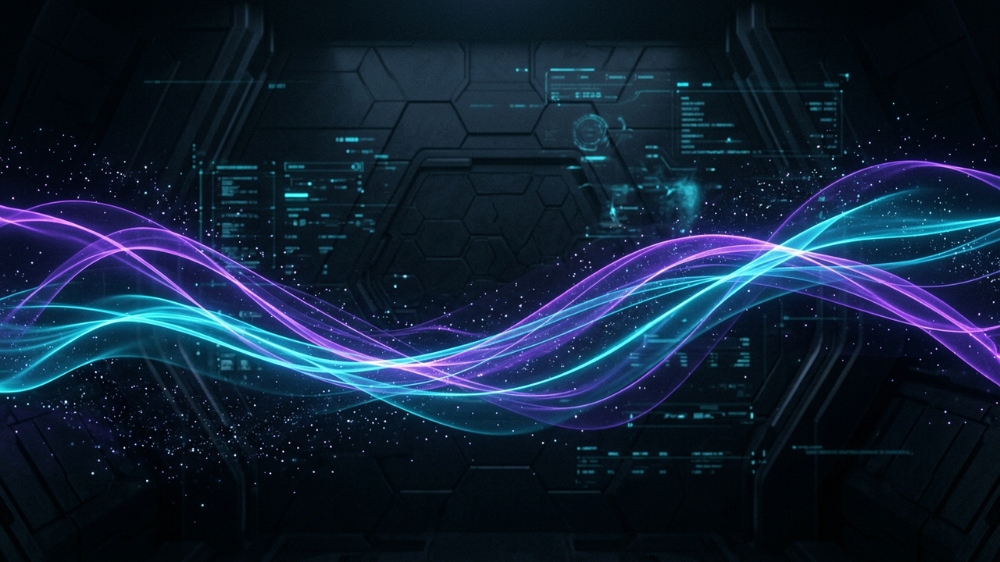
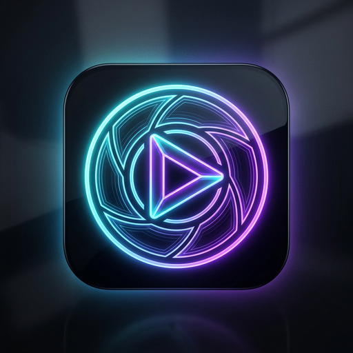

<p align="center">
  
</p>

<p align="center">
  
</p>

<h1 align="center">Dola Video Studio</h1>

<p align="center">
  <strong>Autonomous batch video creation, unwatermarked 1080p MP4 downloading, and native in-browser dynamic watermark removal for Dola AI and Doubao.</strong>
</p>

<p align="center">
  
  
  
  
  
  <br>
  <a href="https://github.com/Yeamin-Sheikh/dola-extension/releases/latest/download/dola-extension.zip">
    
  </a>
</p>

<p align="center">
  <a href="#overview">Overview</a> •
  <a href="#key-features">Key features</a> •
  <a href="#quick-start">Quick start</a> •
  <a href="#workflow-modes">Workflow modes</a> •
  <a href="#watermark-cleaning-engine">Watermark engine</a> •
  <a href="#architecture">Architecture</a> •
  <a href="#settings-reference">Settings</a> •
  <a href="#repository-structure">Structure</a>
</p>

---

## Overview

Dola Studio is a Manifest V3 browser extension for creators using Dola AI (`dola.com/chat`) and Doubao (`doubao.com`). It pairs a high-density side panel interface with an automated chat injection engine, direct stream decoders, and a self-contained in-browser video inpainting engine.

When Dola AI produces videos, it outputs either raw unwatermarked 1080p MP4 video streams or ByteDance dynamic watermark streams with moving corner stamps. Dola Studio detects both stream variants at the network level. Raw streams are downloaded directly as unwatermarked MP4 files, while dynamic watermark streams are processed frame-by-frame inside Chrome offscreen documents using multiscale harmonic diffusion with synchronous Web Audio retention.

Cleaned output videos are saved into a dedicated `cleaned/` subfolder, keeping original downloads and inpainted files separated.

---

## Key features

| Feature | Description | Mechanism |
|---|---|---|
| **Multi-format prompt parser** | Parses numbered lists (`1.`, `2.`), bullet points (`-`), section headers (`Prompt 1:`), and blank-line separated blocks without collapsing prompts. | Regular expression prefix segmentation in `sidepanel.js` |
| **Paste to chat input** | One-click button to immediately paste formatted prompts with the official Generate Videos skill chip directly into Dola's editor. | Polling editor search with synthetic Tiptap mention insertion |
| **In-browser watermark removal** | Removes moving ByteDance watermarks without external Python scripts, terminal watchers, or local servers. | Multiscale harmonic diffusion in Canvas via Chrome offscreen document |
| **Audio track preservation** | Retains synchronous AAC audio tracks during canvas inpainting. | HTMLMediaElement audio capture stream linked to Web Audio API destination |
| **Cleaned output segregation** | Routes inpainted videos into `Downloads/Dola_Videos/cleaned/` while raw originals stay in `Downloads/Dola_Videos/`. | Chrome downloads filename suggestion pipeline |
| **Open folder location** | One-click access from the Captured header, empty list, and Settings to reveal `Downloads/Dola_Videos/cleaned/` in Windows File Explorer. | Multi-tier download verification and directory anchor resolution |
| **Sidebar auto-zoom** | Scales down the active Dola webpage to 80% while the sidebar is open, and restores 100% zoom when closed. | `chrome.tabs.setZoom` API coordination with fallback DOM scaling |
| **Screen video grabber** | Grabs and downloads any finished video currently visible in the active tab. | DOM video element inspection and main-world media extraction |
| **Prompt-based file naming** | Names downloaded MP4 files directly after the prompt text with clean ASCII sanitization. | Prompt capture listener and filename sanitization pipeline |

---

## Quick start

### Option 1: Load unpacked folder

1. Clone or download this repository.
2. Open Google Chrome and navigate to `chrome://extensions/`.
3. Enable the **Developer mode** toggle in the top right corner.
4. Click **Load unpacked** and select the root repository directory.
5. Open `https://www.dola.com/chat`.
6. Click the extension icon in the toolbar to dock the sidebar.

```bash
git clone https://github.com/Yeamin-Sheikh/dola-extension.git
```

### Option 2: Pre-packaged ZIP

1. Download **[dola-extension.zip](https://github.com/Yeamin-Sheikh/dola-extension/releases/latest/download/dola-extension.zip)**.
2. Extract the archive into a folder.
3. Open `chrome://extensions/`, enable **Developer mode**, click **Load unpacked**, and select the extracted directory.

---

## Workflow modes

Dola Studio supports two execution modes:

```
Mode 1: Instant Demonstration
[Paste Prompts] -> [Click "Paste to Chat Input"] -> [Editor populated with Skill Chip] -> [Send manually]

Mode 2: Full Unattended Automation
[Paste Prompts] -> [Click "Start Batch Generation"] -> [New Chat] -> [Greeting] -> [Bypass Agreement] -> [Auto-Submit]
```

### Mode 1: Instant demonstration paste

This mode is designed for live demonstrations, manual prompt review, or quick single runs:

1. Paste prompts into the **Video prompts** text area.
2. Select your desired aspect ratio (`9:16 Vertical`, `16:9 Wide`, or `Raw Prompt`).
3. Click **Paste to Chat Input**.
4. The extension waits for the editor, types `/generate video` with a typing animation, inserts the official skill chip, advances to a new line, and pastes all numbered prompts.
5. Review the text in Dola and click the send button whenever you are ready.

### Mode 2: Unattended batch automation

This mode runs the complete multi-step generation workflow hands-free:

1. Paste prompts into the **Video prompts** text area.
2. Click **Start Batch Generation**.
3. The extension opens a fresh chat if **Start new chat per batch** is enabled.
4. It sends the health check greeting (`hey buddy`). If Dola takes longer than 18 seconds to reply, it logs a warning and continues without halting.
5. It sends the batch agreement instructions to set unattended generation mode. If confirmation takes longer than 22 seconds, it continues without halting.
6. It types `/generate video`, inserts the skill chip, inserts all prompts, activates the Dola send button, and submits the batch.
7. It monitors stream completion and downloads every generated video as it finishes.

---

## Watermark cleaning engine

ByteDance AI video generation overlays either static watermarks (stationary in the bottom-right corner for the full duration) or dynamic watermarks (rotating across three screen quadrants):

```
+---------------------------------------+
|                       [ Quadrant 3 ]  |  Quadrant 3: Top-Right
|                       (rx: 0.68-0.98) |  (faint white stamp)
|                       (ry: 0.03-0.16) |
|                                       |
| [ Quadrant 2 ]                        |  Quadrant 2: Mid-Left
| (rx: 0.02-0.30)                       |  (transition wipe area)
| (ry: 0.44-0.57)                       |
|                                       |
|                       [ Quadrant 1 ]  |  Quadrant 1: Bottom-Right
|                       (rx: 0.68-0.98) |  (stationary static watermark / primary dynamic stamp)
|                       (ry: 0.84-0.97) |
+---------------------------------------+
```

### Inpainting pipeline

1. **Watermark classification**: Identifies whether the stream carries a static watermark (`video_gen_watermark`), dynamic rotating watermark (`video_gen_watermark_dyn`), or pristine 1080p raw master.
2. **Quadrant isolation**: Static watermarks are continuously inpainted at Quadrant 1 (Bottom-Right) across 100% of video frames. Dynamic watermarks run an automated 12-second 3-phase rotation cycle with transition overlap buffering.
3. **Elliptical boundary feathering**: Rectangular binary masks cause boxy optical distortion. Dola Studio applies soft elliptical masks with Gaussian feathering (`sigma=16`) so pixel weights decay smoothly to 0.0 at zone boundaries.
4. **Multiscale harmonic diffusion**: Background textures are reconstructed frame-by-frame using a 4x downsampled Laplacian boundary solver with 6 relaxation sweeps. This runs at approximately 1.1ms per frame, ensuring steady 30fps and 60fps processing.
5. **Synchronous Web Audio stream**: An `AudioContext` taps the video source stream, piping original audio into a `MediaStreamDestinationNode`.
6. **Hardware MP4 export**: Canvas video frames and audio tracks are captured into an active `MediaStream` and recorded via `MediaRecorder` (`video/mp4;codecs=avc1,mp4a.40.2`).
7. **Segregated download**: Cleaned MP4 files save into `Downloads/Dola_Videos/cleaned/<prompt>_clean.mp4`, while raw unwatermarked masters save into `Downloads/Dola_Videos/<prompt>.mp4`.

---

## Architecture

The extension is organized into five isolated layers communicating over origin-verified Chrome message channels:

```
+-------------------------------------------------------------------------+
|                        Dola Studio Side Panel                           |
|   - Multi-format prompt parser (numbers, bullets, headers, paragraphs)  |
|   - Aspect ratio segmented control (9:16, 16:9, Raw)                    |
|   - Queue controller and tab zoom coordinator (80% workspace scale)     |
|   - Video history panel with direct Windows Explorer file links         |
+-------------------------------------------------------------------------+
                                     | chrome.tabs.sendMessage
+------------------------------------v------------------------------------+
|                     Content Script (content.js)                         |
|   - Workflow state machine (New Chat -> Greeting -> Bypass -> Prompts)  |
|   - Non-fatal AI responsiveness timers                                  |
|   - DOM download link scanner and canonical media key deduplication     |
+-------------------------------------------------------------------------+
                                     | CustomEvent bridge
+------------------------------------v------------------------------------+
|                   Main World Script (extractor.js)                      |
|   - Fetch and XHR payload interceptor (QAAB AES-CBC token decryption)   |
|   - Polling editor finder (waitForDolaEditor across 4 DOM selectors)    |
|   - Dual injection (Tiptap skill mention chip + DOM execCommand fallback|
|   - Send button targeting (#flow-end-msg-send container isolation)      |
+-------------------------------------------------------------------------+
                                     | chrome.runtime.sendMessage
+------------------------------------v------------------------------------+
|                  Background Worker (background.js)                      |
|   - In-memory Blob download pipeline                                    |
|   - Filename ASCII sanitization based on prompt text                    |
|   - Stream classifier (Raw 1080p Master vs Dynamic Watermark)           |
+-------------------------------------------------------------------------+
                 |                                         |
    (Raw Master) |                      (Dynamic Watermark)|
                 v                                         v
+--------------------------------+        +--------------------------------+
|   Chrome Downloads Manager     |        | Chrome Offscreen (offscreen.js)|
|   Saves directly to:           |        | - Canvas multiscale harmonic   |
|   Downloads/Dola_Videos/       |        |   diffusion inpainting         |
|   <prompt>.mp4                 |        | - Web Audio sync pipeline      |
+--------------------------------+        | - Hardware MediaRecorder MP4   |
                                          +--------------------------------+
                                                           |
                                                           v
                                          +--------------------------------+
                                          |   Chrome Downloads Manager     |
                                          |   Saves directly to:           |
                                          |   Downloads/Dola_Videos/       |
                                          |   cleaned/<prompt>_clean.mp4   |
                                          +--------------------------------+
```

---

## Settings reference

Open the **Settings** tab in the sidebar to configure preferences. All settings persist across sessions in `chrome.storage.local`.

| Group | Setting | Default | Description |
|---|---|---|---|
| **Downloads & storage** | Auto-download videos | Enabled | Automatically downloads videos upon generation completion. |
| | Destination subfolder | `Dola_Videos` | Target folder inside your Windows `Downloads` directory. |
| | Open folder location | One-click button | Launches Windows File Explorer directly inside `Downloads/<subfolder>/cleaned/`. |
| | Desktop notifications | Disabled | Displays native Chrome desktop notifications for completed downloads. |
| **Automation sequence** | Start new chat per batch | Enabled | Opens a clean chat conversation before starting a new batch. |
| | AI health check greeting | `hey buddy` | Initial greeting to verify AI connection before prompt transmission. |
| | Unattended bypass instruction | Built-in preset | Agreement prompt instructing Dola to process all videos without confirmation pauses. |
| **Workspace & display** | Auto-zoom on batch | Enabled | Scales active Dola tab to fit sidebar without horizontal scrollbars. |
| | Default zoom factor | `80%` | Zoom level applied while sidebar is connected (options: 75%, 80%, 85%, 90%, 100%). |

---

## Context menus and shortcuts

### Browser context menu

Right-click anywhere in Chrome to access Dola Studio actions:

* **Open Dola Studio sidebar**: Opens or focuses the side panel.
* **Download visible video**: Captures the video currently playing on screen.
* **Add selected text to prompts**: Appends highlighted text into the batch prompt queue.
* **Download video from link**: Direct link capture for media URLs.

### In-app context menu

Right-click inside any text input or selection within the side panel or popup:

* **Cut** (`Ctrl+X`)
* **Copy** (`Ctrl+C`)
* **Paste** (`Ctrl+V`)
* **Select all** (`Ctrl+A`)

---

## Repository structure

```
dola-extension/
├── manifest.json               # Extension configuration, permissions, and worker setup
├── background.js               # Background service worker with Blob download pipeline
├── content.js                  # Automation bridge and tab communication
├── extractor.js                # Main-world network interceptor and editor injector
├── offscreen.html              # Host document for in-browser canvas cleaning
├── offscreen.js                # Multiscale harmonic diffusion inpainting engine
├── sidepanel.html              # High-density obsidian sidebar interface
├── sidepanel.css               # 125% DPI optimized design system
├── sidepanel.js                # Prompt parser, zoom coordinator, and queue runner
├── popup.html                  # Browser toolbar popup
├── popup.css                   # Toolbar popup styling
├── popup.js                    # Toolbar popup controller
├── icon16.png                  # 16x16 browser toolbar icon
├── icon32.png                  # 32x32 high-DPI icon
├── icon48.png                  # 48x48 extension management icon
├── icon128.png                 # 128x128 store display icon
├── assets/                     # Graphic assets and presentation artwork
│   ├── logo.png                # Aperture play button squircle icon
│   └── banner.png              # Dark ambient HUD particle banner
├── LICENSE                     # MIT License
├── PROGRESS.md                 # Development progress and session log tracker
├── .gitignore                  # Git ignore patterns
└── README.md                   # Master repository documentation
```

---

## License

Developed by **Yeamin Sheikh**. Released under the [MIT License](LICENSE).
